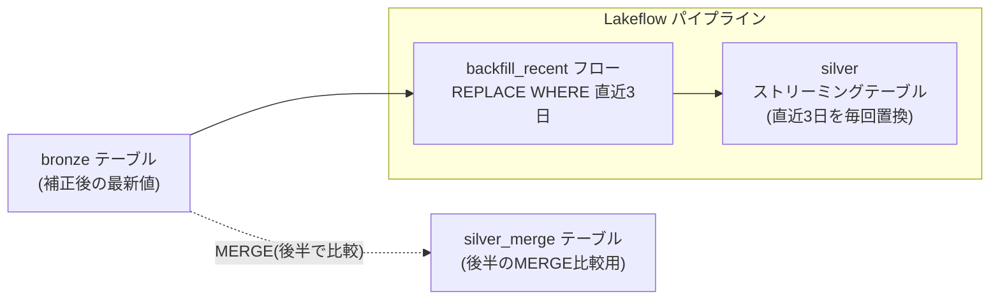

## この記事で分かること

集計テーブルを日次で更新している方に向けた記事です。

小売や SaaS のデータでは、返品・キャンセル・入力ミスの補正が翌日や翌々日に届きます。今日計上した売上が、数日後に金額訂正される、といったことは珍しくありません。こうした「あとから確定する数日ぶんの補正」を、毎日のバッチで自動的に取り込みたい、というのがこの記事のテーマです。

2026 年 7 月に GA になった Databricks の REPLACE WHERE フローを使うと、「直近 N 日だけを毎回作り直す」処理を述語ひとつで宣言できます。うれしいのは書きやすさだけではありません。範囲の外にある古い履歴を読み直さないため性能面でも有利で、変更分だけを処理する増分モードでは、範囲をまるごと書き直す方式と比べて最大 3.4 倍高速・2.5 倍低コストという公式ベンチマーク（TPC-DI）も報告されています。

実際に Lakeflow パイプラインで動かし、返品や訂正がきれいに反映される様子を、ビルド前後の結果で確認します。

公式リリースノート: [Databricks Documentation](https://docs.databricks.com/aws/en/release-notes/product/2026/july#replace-where-flows-are-now-generally-available)

:::message
内容は記事作成時点のものです。
仕様は変更され得るため、最終的には最新の公式ドキュメントで確認ください。
:::


## 返品や補正で、数日前のトランザクションが書き換わる

売上や注文の集計テーブルを日次で運用していると、「今日の日付ぶんを取り込めば終わり」とはいかない場面によく出くわします。

返品処理は数日遅れて確定します。POS やフォームの入力ミスも、気づいて直されるのは翌日以降です。決済のキャンセルも同じで、いったん計上した金額があとから減額されます。つまり数日前のトランザクションが、返品や補正によってあとから書き換わっていきます。

ところが多くの取り込みジョブは「今日の日付ぶんだけ `INSERT` する」設計になっています。この運用では、数日前に届いた補正を二度と読み直しません。結果として、実態とわずかにズレた数字を抱えたままダッシュボードを見続けることになります。

かといって、毎回テーブル全体を作り直すのは現実的ではありません。履歴が数年ぶんたまってくると、変わっていない大部分まで読み直すことになり、実行時間もコストも膨らみます。欲しいのは「直近の数日だけを、確実に作り直す」しくみです。

## REPLACE WHERE フローで、作り直す範囲だけを決める

REPLACE WHERE フローは、リフレッシュのたびに述語で指定した範囲だけを丸ごと置き換えます。

たとえば「直近 3 日ぶんを、毎回まるごと入れ替える」と宣言しておけば、遅れて届いた補正がその範囲に含まれる限り自動的に反映されます。範囲の外にある古い履歴には触れないため、テーブル全体の再処理は起きません。

書くのは「どう置き換えるか」ではなく「どの範囲を置き換えるか」だけです。更新・挿入・削除の場合分けを自分で組み立てる必要はなく、述語で範囲を切って、その範囲を最新の状態で上書きする、という発想になります。範囲を宣言するだけなので SQL は短く保守しやすく、範囲外を触らないぶん性能面でも有利です。さらに Databricks 側の増分最適化も効きます。

## 実際に動かしてみよう

先に、今回つくるオブジェクトの全体像を示します。ソースの `bronze` から、REPLACE WHERE フロー `backfill_recent` を通して、集計先のストリーミングテーブル `silver` へ流します。記事後半で MERGE と比べるために、同じ結果を作る `silver_merge`（通常テーブル）も用意します。



`bronze` は普通のテーブルですが、`silver` はパイプラインの中で宣言するストリーミングテーブルです。両者をつなぐのが `backfill_recent` という 1 本のフローで、ここに `REPLACE WHERE` の述語を書きます。

次のシナリオで動かします。

- **今日は 2026-08-03 とします。** 集計テーブルは「直近 3 日ぶん（`current_date() - 3` = 7/31 以降）」を、毎回のビルドでまるごと作り直す運用です。
- まず前日までのデータでテーブルを 1 回ビルドします（これが Before）。
- そのあと、返品・訂正・遅延到着の補正がソースに届いた状態で、もう一度ビルドします（これが After）。

ソースの `bronze` には常に「補正後の最新値」が入る前提です。日付はハードコードせず `date_add(current_date(), -3)` で「直近 3 日」を表現します。実運用でもこの書き方になります。

:::details セットアップ（ソーステーブルの作成・初期データ投入）

```sql
CREATE SCHEMA IF NOT EXISTS workspace.rwdemo;

-- ソース: 補正後の最新トランザクションが入る想定
CREATE OR REPLACE TABLE workspace.rwdemo.bronze (
  txn_date DATE, txn_id STRING, region STRING, amount DECIMAL(10,2)
);

-- 前日まで（8/2 まで）に確定していたデータ
INSERT INTO workspace.rwdemo.bronze VALUES
  (DATE '2026-07-28', 'T-100', 'east', 50.00),  -- 直近3日より前（ウィンドウ外）
  (DATE '2026-07-31', 'T-201', 'east', 60.00),
  (DATE '2026-08-01', 'T-202', 'west', 30.00),
  (DATE '2026-08-02', 'T-203', 'east', 20.00);
```

:::

### ステップ1: REPLACE WHERE フローを Lakeflow パイプラインで定義する

置き換え先のストリーミングテーブルを宣言し、そこへ流し込むフローを書きます。述語は `date_add(current_date(), -3)` で「直近 3 日」を表します。

```sql
-- パイプラインのターゲット
CREATE OR REFRESH STREAMING TABLE workspace.rwdemo_out.silver;

-- 「直近3日ぶん」を毎回まるごと置き換えるフロー
CREATE FLOW backfill_recent
AS INSERT INTO workspace.rwdemo_out.silver BY NAME
REPLACE WHERE txn_date >= date_add(current_date(), -3)
SELECT txn_date, txn_id, region, amount
FROM workspace.rwdemo.bronze
WHERE txn_date >= date_add(current_date(), -3);
```

書いているのは「直近 3 日の範囲を、この SELECT の結果でまるごと置き換える」という宣言だけです。更新・挿入・削除の指定は一切ありません。

### ステップ2: 1回目のビルド結果を確認する（Before）

パイプラインを実行すると、イベントログに置き換えモードが記録されます。

実行結果（パイプラインイベントログ抜粋）:
```
Flow 'backfill_recent' has been planned to be executed as COMPLETE_REPLACE_WHERE.
Flow 'backfill_recent' has COMPLETED.
Update 32d928 is COMPLETED.
```

この時点の `silver` を見てみます。

```sql
SELECT * FROM workspace.rwdemo_out.silver ORDER BY txn_date, txn_id;
```

実行結果:
```
txn_date    txn_id  region  amount
2026-07-31  T-201   east    60.00
2026-08-01  T-202   west    30.00
2026-08-02  T-203   east    20.00
```

直近 3 日（7/31・8/1・8/2）の 3 行だけが入っています。範囲外の 7/28（T-100）は、そもそも対象にしていないため入りません。

### ステップ3: 補正がソースに届く

翌日の運用を想定して、`bronze` に返品・訂正・遅延到着を反映します。

```sql
-- T-201: 返品で 60.00 → 40.00 に減額
UPDATE workspace.rwdemo.bronze SET amount = 40.00 WHERE txn_id = 'T-201';
-- T-203: 入力訂正で 20.00 → 25.00
UPDATE workspace.rwdemo.bronze SET amount = 25.00 WHERE txn_id = 'T-203';
-- T-204: 8/3 ぶんが遅れて届いた（新規）
INSERT INTO workspace.rwdemo.bronze VALUES (DATE '2026-08-03', 'T-204', 'west', 12.00);
```

### ステップ4: 2回目のビルド結果を確認する（After）

同じパイプラインをもう一度実行し、`silver` を見ます。

```sql
SELECT * FROM workspace.rwdemo_out.silver ORDER BY txn_date, txn_id;
```

実行結果:
```
txn_date    txn_id  region  amount
2026-07-31  T-201   east    40.00
2026-08-01  T-202   west    30.00
2026-08-02  T-203   east    25.00
2026-08-03  T-204   west    12.00
```

ビルド前後を並べると、直近 3 日ぶんに届いた補正が、そのまま反映されているのが分かります。

| txn_id | 日付 | Before | After | 起きたこと |
|--------|------|--------|-------|-----------|
| T-201  | 7/31 | 60.00  | 40.00 | 返品で減額 |
| T-202  | 8/1  | 30.00  | 30.00 | 変化なし |
| T-203  | 8/2  | 20.00  | 25.00 | 入力訂正 |
| T-204  | 8/3  | （なし）| 12.00 | 遅れて届いた新規 |

フローの定義には `date_add(current_date(), -3)` という述語しか書いていないのに、減額・訂正・新規到着の 3 種類の補正がすべて取り込まれました。範囲外の 7/28（T-100）は、Before でも After でも一切触られていません。

## これ、MERGE でもできるのでは？

ここまで読んで、「同じことは既存の MERGE でも書けるのでは」と思った方も多いはずです。実際そのとおりで、機能としては MERGE でも実現できます。念のため同じ補正取り込みを MERGE で書くと、こうなります。

```sql
MERGE INTO workspace.rwdemo.silver_merge AS t
USING (
  SELECT txn_date, txn_id, region, amount
  FROM workspace.rwdemo.bronze
  WHERE txn_date >= date_add(current_date(), -3)
) AS s
ON t.txn_id = s.txn_id AND t.txn_date >= date_add(current_date(), -3)
WHEN MATCHED THEN UPDATE SET *
WHEN NOT MATCHED THEN INSERT *
WHEN NOT MATCHED BY SOURCE AND t.txn_date >= date_add(current_date(), -3) THEN DELETE;
```

実行結果（先ほどと同じ補正後 `bronze` に対して実行）:
```
txn_date    txn_id  region  amount
2026-07-31  T-201   east    40.00
2026-08-01  T-202   west    30.00
2026-08-02  T-203   east    25.00
2026-08-03  T-204   west    12.00
```

結果自体は REPLACE WHERE と同じで、補正はきちんと反映されます。ただし書き方を見ると違いがはっきりします。

同じ「直近 3 日」という条件を、`ON` 句と `NOT MATCHED BY SOURCE` の `DELETE` 句に重ねて書いています。ウィンドウを表す条件が複数箇所に散らばり、どれか一つでも書き漏らすと、ウィンドウ外の行を消してしまう事故につながります。取消済みの行を消し、補正済みの行を更新し、新規を挿入する——この 3 種類の分岐を、自分ですべて正しく組み立てる必要があります。

REPLACE WHERE フローでは、この場合分けが消えて述語の宣言だけが残ります。「範囲を切って、その範囲を最新の結果で置き換える」という意図が、そのまま SQL に表れています。

そして本当の差は性能です。REPLACE WHERE フローは、範囲の外にあるデータを読み直しません。さらに増分モード（Enzyme）が効くのはこちら側だけで、範囲をまるごと書き直す方式と比べて最大 3.4 倍高速・2.5 倍低コストという公式ベンチマーク（TPC-DI）が報告されています。MERGE は「できる」けれど、毎回ソースクエリを評価し直すため、この最適化は効きません。

書きやすさで選ぶというより、**範囲外を読み直さず増分で処理できるぶん速くて安いから REPLACE WHERE を選ぶ**、というのが実際に並べてみた結論です。読者の環境でもこの数字がそのまま出るとは限りませんが、「範囲外を触らない」という設計そのものが効いてくる場面は多いはずです。

## 手を動かして分かったこと

検証を通して、ドキュメントを読むだけでは気づきにくい点が2つありました。

### 1 つの集計テーブルに、REPLACE WHERE フローは 1 本しか向けられない

やりたくなるのが、こういう構成です。全国の売上を 1 つの `silver` テーブルに集約したいとき、東日本の店舗からの取り込みと西日本の店舗からの取り込みで、ソースやスキーマが別々になっていることはよくあります。そこで「東日本ぶんを置き換えるフロー」「西日本ぶんを置き換えるフロー」を別々に書いて、両方を同じ `silver` に向けたくなります。

```sql
-- こう書きたくなる（が、動かない）
CREATE FLOW east_flow
AS INSERT INTO silver BY NAME
REPLACE WHERE region = 'east'
SELECT * FROM bronze_east;

CREATE FLOW west_flow
AS INSERT INTO silver BY NAME
REPLACE WHERE region = 'west'
SELECT * FROM bronze_west;
```

ところが、1 つのターゲットテーブルに REPLACE WHERE フローを 2 本以上向けると、パイプラインは起動に失敗します。実際に試すと、2 本目を足した瞬間にエラーになりました（フローが 1 本だけなら、まったく同じ構成で成功します）。公式ドキュメントにも「1 つのターゲットテーブルにつき REPLACE WHERE フローは 1 本まで」と明記されています。

つまり REPLACE WHERE は「複数のソースを担当ごとに分けて 1 テーブルへ流し込む」用途には使えません。地域や取り込み元でパーティションを分担させたい場合は、テーブル自体を分けるか、`UNION` などでソースを 1 つにまとめてから 1 本のフローで流す、といった設計にする必要があります。REPLACE WHERE の「範囲」は、あくまで 1 本の述語で表せる範囲、という前提で組み立てるのが安全です。

### パイプラインの出力先スキーマは、ソースと別のスキーマにする

REPLACE WHERE フローを使うパイプラインを組むとき、ソーステーブル（`bronze`）と出力先テーブル（`silver`）を同じスキーマに置くと、パイプラインが起動に失敗します。

パイプラインはストリーミングテーブルを作る際、裏で `__materialization_...` という内部管理用のテーブルを同じスキーマに生成します。ソースと同居させると、この内部生成物が既存テーブルと名前空間で衝突し、`Found duplicate dataset` エラーになります。今回の検証でも、ソースと出力先を同じスキーマにした構成では失敗し、出力先を別スキーマに分けたら成功しました。ソース用と出力先用でスキーマを分けておくのが無難です。


## 検証コード

この記事のハンズオンで使用した SQL を Notebook（.ipynb）形式で公開しています。

Databricks にインポートすれば、そのまま自分の環境で実行できます。

[📓 検証ノートブックを開く（GitHub）](https://github.com/GTK0326/zenn-content/blob/main/notebooks/d9-replace-where-flows-are-now-generally-available.ipynb)
## まとめ

REPLACE WHERE フローを使うと、「置き換える範囲」を述語で宣言するだけで、遅れて届く返品や補正を毎回のリフレッシュで自動的に取り込めます。今回は `date_add(current_date(), -3)` で直近 3 日を宣言し、返品・訂正・遅延到着がビルドのたびに反映されることを確認しました。

同じことは MERGE でも書けます。ただし REPLACE WHERE の一番の利点は書きやすさではなく性能で、範囲外を読み直さず増分で処理できるぶん、全書き換え比で最大 3.4 倍高速・2.5 倍低コストという数字も報告されています。日次で数日ぶんの補正を取り込む集計テーブルを運用しているなら、まず手元のパイプラインで試してみてください。

## 参考リンク

- [REPLACE WHERE flows are now generally available — Databricks release notes (July 2026)](https://docs.databricks.com/aws/en/release-notes/product/2026/july#replace-where-flows-are-now-generally-available)
- [Batch processing with REPLACE WHERE flows — Databricks Documentation](https://docs.databricks.com/aws/en/ldp/flows-replace-where)
- [Incremental REPLACE WHERE Flows Brings Targeted Refreshes to SDP — Databricks Community 技術ブログ（Databricks 社員による。3.4x/2.5x のベンチマーク出典）](https://community.databricks.com/t5/technical-blog/incremental-replace-where-flows-brings-targeted-refreshes-to-sdp/ba-p/159057)