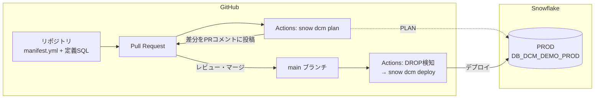

## この記事で分かること

Snowflake のオブジェクト管理（テーブル・ロール・ネットワークポリシー等）をコード化して CI/CD に乗せたい方向けの記事です。

DCM Projects（Preview）を **GitHub + GitHub Actions で実運用する構成をゼロから構築**し、「PR を作ると差分が PR コメントに載り、マージすると Snowflake に自動デプロイされる」ところまで実際に動かします。

- リポジトリに何を置くか
- GitHub / Snowflake 双方のセットアップ手順
- PR 作成からデプロイまでの実際の動き
- 実際に構築して踏んだハマりどころ

:::message
DCM Projects は Preview 機能です。内容は記事作成時点のものです。
:::


## DCM Projects とは — CREATE OR ALTER の「プロジェクト版」

DCM（Declarative Change Management）Projects は、Snowflake オブジェクトの「あるべき状態」を SQL の `DEFINE` 構文で宣言し、Snowflake 側が差分を計算して適用する仕組みです。

[前回の記事](https://zenn.dev/gtk0326/articles/i165-feature-update-2026-07-14-create-or-alter-is-)で書いた `CREATE OR ALTER` が「1 オブジェクトを 1 文で収束させる」構文だったのに対し、DCM Projects はこれをプロジェクト単位に引き上げたものです。

| | CREATE OR ALTER | DCM Projects |
|---|---|---|
| 管理単位 | 1 オブジェクト = 1 文 | プロジェクト（定義ファイル一式） |
| 適用前の差分確認 | なし（実行あるのみ） | **PLAN で事前プレビュー** |
| 定義から消したオブジェクト | 残り続ける | **デプロイ時に DROP される（要注意）** |
| 環境分離 | 自前でスクリプト分岐 | manifest.yml の targets + テンプレート変数 |

前回の記事で「`CREATE OR ALTER` には Terraform の plan にあたる意図しない変更の検知がない」というデメリットを挙げましたが、**DCM Projects の PLAN がまさにそのギャップを埋める**位置づけです。

## 2026-07-16 のアップデートで追加された 10 の新機能

DCM Projects は開発が活発で、2026年7月16日にも 10 個の新機能が追加されています（[リリースノート](https://docs.snowflake.com/en/release-notes/2026/other/2026-07-16-dcm-projects-new-capabilities)）。

**① DEFINE / ATTACH できる対象の拡充（7つ）**

| 新機能 | 内容 |
|--------|------|
| DEFINE NETWORK RULE | ネットワークルールを宣言的に管理 |
| DEFINE NETWORK POLICY | ネットワークポリシーを宣言的に管理 |
| DEFINE MASKING POLICY | マスキングポリシーのライフサイクル管理（列へのアタッチは未対応） |
| Python / Java ハンドラー | DEFINE FUNCTION / PROCEDURE が SQL 以外にも対応 |
| DEFINE ALERT の target state | アラートの STARTED / SUSPENDED を宣言的に指定 |
| ATTACH TAG | タグ付与を宣言的に管理（テーブル・ビューの列にも対応） |
| ATTACH DMF の EXECUTE AS ROLE | プロジェクト外のテーブルにも DMF をアタッチ可能 |

**② 運用・権限管理を楽にする機能（3つ）**

| 新機能 | 内容 |
|--------|------|
| PLAN DELTA | 前回デプロイ以降の変更と下流のみを評価する高速版 PLAN。開発中の反復向け（デプロイ判断はフル PLAN で） |
| Inherited grants | `INHERITED` キーワードで「このDB配下の将来のオブジェクト全部に SELECT」を 1 文で宣言（アカウントレベルの behavior change パラメーター有効化が必要） |
| Container-level MANAGE GRANTS | DB・スキーマ単位で権限管理を委任。SECURITYADMIN を配らずに済む |

ガバナンス系オブジェクト（ネットワーク・マスキング）の DEFINE 対応で「コード化できる範囲」が広がり、PLAN DELTA や権限委任で「運用のしやすさ」も強化された、という 2 方向のアップデートです。

## 全体構成

今回構築した構成です。



- **デプロイの起点は GitHub Actions 上の Snowflake CLI（`snow dcm`）**
- **認証は OIDC（Workload Identity Federation）**。GitHub の ID トークンで直接 Snowflake に認証するため、パスワードや秘密鍵をシークレットに保管しない
- **PR で PLAN、マージでデプロイ**。データを持つオブジェクトへの DROP を検知したらデプロイをブロック

## セットアップ手順

### 1. リポジトリに置くもの

ディレクトリ構成は[公式 Quickstart](https://github.com/Snowflake-Labs/snowflake-dcm-projects) に倣い、プロジェクトをサブディレクトリ（`dcm/`）に置きます。

```
my-dcm-repo/
├── dcm/
│   ├── manifest.yml                  # ターゲット環境・変数の定義
│   └── sources/
│       ├── definitions/              # DEFINE / GRANT のSQL定義ファイル
│       │   ├── warehouses.sql        # ウェアハウス
│       │   ├── roles_and_grants.sql  # ロール
│       │   ├── security.sql          # NWルール・ポリシー類
│       │   └── sales.sql             # ドメイン(DB)単位: DB・スキーマ・テーブル・ビュー
│       └── macros/                   # 共通Jinja2マクロ（自動インポート）
└── .github/workflows/
    ├── dcm-plan-pr.yml               # PR時: plan → PRコメント
    └── dcm-deploy.yml                # mainマージ時: DROP検知 → deploy
```

**manifest.yml** — ターゲット環境と変数を定義します。

```yaml
manifest_version: 2
type: DCM_PROJECT
default_target: DCM_PROD
targets:
  DCM_PROD:
    account_identifier: "********"   # 自分のアカウント識別子（orgname-accountname）
    project_name: DB_DCM_ADMIN.DCM.MY_DCM_PROJECT
    project_owner: DCM_DEPLOY_ROLE
    templating_config: prod
templating:
  configurations:
    prod:
      env: PROD
      wh_size: XSMALL
```

**定義ファイル** — 書けるのは **DEFINE / GRANT / ATTACH 文のみ**、オブジェクト名は**完全修飾が必須**です。環境差分は Jinja2 変数 `{{ env }}` で吸収します。

```sql
-- sales.sql（ドメインのDB・スキーマ・テーブル・ビューを1ファイルに）
DEFINE DATABASE DB_DCM_DEMO_{{ env }};
DEFINE SCHEMA DB_DCM_DEMO_{{ env }}.SALES;

DEFINE TABLE DB_DCM_DEMO_{{ env }}.SALES.ORDERS (
  order_id    NUMBER,
  customer_id NUMBER,
  amount      NUMBER(12,2),
  ordered_at  TIMESTAMP_NTZ
);

DEFINE VIEW DB_DCM_DEMO_{{ env }}.SALES.V_DAILY_SALES AS
  SELECT DATE_TRUNC('DAY', ordered_at) AS sales_date,
         COUNT(*) AS order_count, SUM(amount) AS total_amount
  FROM DB_DCM_DEMO_{{ env }}.SALES.ORDERS GROUP BY 1;
```

```sql
-- warehouses.sql（アカウントレベル: ウェアハウス）
DEFINE WAREHOUSE WH_DCM_DEMO_{{ env }}
  WITH warehouse_size = '{{ wh_size }}' auto_suspend = 60 initially_suspended = TRUE;
```

```sql
-- roles_and_grants.sql（アカウントレベル: ロールと GRANT はセットで管理）
DEFINE ROLE DCM_DEMO_ANALYST_{{ env }};

GRANT USAGE ON DATABASE DB_DCM_DEMO_{{ env }} TO ROLE DCM_DEMO_ANALYST_{{ env }};
GRANT USAGE ON SCHEMA DB_DCM_DEMO_{{ env }}.SALES TO ROLE DCM_DEMO_ANALYST_{{ env }};
GRANT SELECT ON TABLE DB_DCM_DEMO_{{ env }}.SALES.ORDERS TO ROLE DCM_DEMO_ANALYST_{{ env }};
GRANT SELECT ON VIEW DB_DCM_DEMO_{{ env }}.SALES.V_DAILY_SALES TO ROLE DCM_DEMO_ANALYST_{{ env }};
GRANT USAGE ON WAREHOUSE WH_DCM_DEMO_{{ env }} TO ROLE DCM_DEMO_ANALYST_{{ env }};
```

```sql
-- security.sql（2026-07-16 の新機能で DEFINE 対応）
DEFINE NETWORK RULE DB_DCM_DEMO_{{ env }}.SALES.NR_OFFICE_IPS
  TYPE = IPV4 MODE = INGRESS
  VALUE_LIST = ('203.0.113.0/24');
DEFINE NETWORK POLICY NP_DCM_DEMO_{{ env }}
  ALLOWED_NETWORK_RULE_LIST = ('DB_DCM_DEMO_{{ env }}.SALES.NR_OFFICE_IPS');
```

テーブルもロールもウェアハウスも NW ポリシーも、**同じリポジトリ・同じ PR フローで管理**できるのがポイントです。

### 2. GitHub 側の設定

1. リポジトリを作成
2. **Settings > Branches** で main のブランチ保護（PR 必須）を設定
3. **Settings > Environments** で `DCM_PROD` を作成（OIDC の subject と対応させるため必須）

### 3. Snowflake 側の設定

デプロイ用ロール・DCM プロジェクトの格納場所・権限を ACCOUNTADMIN で用意します。

```sql
USE ROLE ACCOUNTADMIN;

-- デプロイ用ロール
CREATE ROLE IF NOT EXISTS DCM_DEPLOY_ROLE;
GRANT ROLE DCM_DEPLOY_ROLE TO ROLE SYSADMIN;

-- DCM プロジェクトオブジェクトの格納場所
CREATE DATABASE IF NOT EXISTS DB_DCM_ADMIN;
CREATE SCHEMA IF NOT EXISTS DB_DCM_ADMIN.DCM;
GRANT USAGE ON DATABASE DB_DCM_ADMIN TO ROLE DCM_DEPLOY_ROLE;
GRANT USAGE ON SCHEMA DB_DCM_ADMIN.DCM TO ROLE DCM_DEPLOY_ROLE;
GRANT CREATE DCM PROJECT ON SCHEMA DB_DCM_ADMIN.DCM TO ROLE DCM_DEPLOY_ROLE;

-- 定義ファイルの内容を作成できる権限
GRANT CREATE DATABASE ON ACCOUNT TO ROLE DCM_DEPLOY_ROLE;
GRANT CREATE ROLE ON ACCOUNT TO ROLE DCM_DEPLOY_ROLE;
GRANT CREATE NETWORK POLICY ON ACCOUNT TO ROLE DCM_DEPLOY_ROLE;
GRANT USAGE ON WAREHOUSE COMPUTE_WH TO ROLE DCM_DEPLOY_ROLE;
```

続いて GitHub Actions 用のサービスユーザーを OIDC（Workload Identity Federation）で作成します。

```sql
CREATE USER IF NOT EXISTS SVC_GITHUB_ACTIONS
  TYPE = SERVICE
  DEFAULT_ROLE = 'DCM_DEPLOY_ROLE'
  DEFAULT_WAREHOUSE = COMPUTE_WH   -- デプロイ後の確認クエリで必要
  WORKLOAD_IDENTITY = (
    TYPE = OIDC
    ISSUER = 'https://token.actions.githubusercontent.com'
    SUBJECT = 'repo:<owner>@<owner_id>/<repo>@<repo_id>:environment:DCM_PROD'
  );
GRANT ROLE DCM_DEPLOY_ROLE TO USER SVC_GITHUB_ACTIONS;
```

:::message alert
**SUBJECT は「ID 付き形式」で登録する**

GitHub が実際に送る JWT の subject は `repo:owner/repo:environment:NAME` ではなく、**owner ID とリポジトリ ID が埋め込まれた形式**でした。

```
repo:<owner>@<owner_id>/<repo>@<repo_id>:environment:DCM_PROD
```

シンプル形式で登録すると認証エラーになります。エラーメッセージに実際の subject がそのまま表示されるので、**一度わざと失敗させて実値をコピーする**のが確実です。
:::

最後に DCM プロジェクトオブジェクトを作成します（ローカルの Snowflake CLI から）。

```powershell
snow dcm create --target DCM_PROD --if-not-exists
```

### 4. ワークフロー

PR 時の plan とマージ時のデプロイを分けます。デプロイ側のポイントを抜粋します。

```yaml
# dcm-deploy.yml（main push 時）の骨子
jobs:
  deploy:
    runs-on: ubuntu-latest
    environment: DCM_PROD          # OIDC subject と一致させる
    permissions:
      id-token: write              # OIDC トークン発行に必須
      contents: read
    defaults:
      run:
        working-directory: dcm     # プロジェクトのサブディレクトリで実行
    steps:
      - uses: actions/checkout@v4

      # Snowflake CLI のインストールと OIDC 認証設定
      - uses: snowflakedb/snowflake-actions@v3
        with:
          use-oidc: "true"
          cli-version: "3.23.0"

      - name: snow dcm plan
        run: snow dcm plan --target DCM_PROD --save-output -x

      # データを持つオブジェクトへの DROP があればブロック
      - name: Block destructive drops
        run: |
          DROPS=$(jq '[.changeset[]? | select(.type == "DROP"
            and (.object_id.domain | IN("DATABASE","SCHEMA","TABLE","STAGE")))] | length' \
            out/plan/plan_result.json)
          [ "$DROPS" -gt 0 ] && exit 1 || true

      - name: snow dcm deploy
        run: snow dcm deploy --target DCM_PROD -x --alias "gha-${GITHUB_SHA::7}"
```

`snow dcm plan --save-output` が `out/plan/plan_result.json` に変更一覧（JSON）を書き出すので、これを jq でパースして DROP 検知に使っています。

## 実際に動かす

### 初回デプロイ

定義ファイル一式を push して plan を実行すると、8 エンティティの CREATE が計画されます。

```
CREATE   DATABASE             DB_DCM_DEMO_PROD
CREATE   NETWORK_POLICY       NP_DCM_DEMO_PROD
CREATE   NETWORK_RULE         DB_DCM_DEMO_PROD.SALES.NR_OFFICE_IPS
CREATE   ROLE                 DCM_DEMO_ANALYST_PROD
CREATE   SCHEMA               DB_DCM_DEMO_PROD.PUBLIC
CREATE   SCHEMA               DB_DCM_DEMO_PROD.SALES
CREATE   TABLE                DB_DCM_DEMO_PROD.SALES.ORDERS
CREATE   VIEW                 DB_DCM_DEMO_PROD.SALES.V_DAILY_SALES

Planned 8 entities (8 to create, 0 to alter, 0 to drop).
```

deploy を実行すると `Deployed 8 entities (8 created, 0 altered, 0 dropped).` で全オブジェクトが作成されます。

:::message
**DEFINE していない PUBLIC スキーマが PLAN に出てくる**

上の PLAN には `CREATE SCHEMA DB_DCM_DEMO_PROD.PUBLIC` が含まれていますが、定義ファイルに PUBLIC スキーマの DEFINE は書いていません。`DEFINE DATABASE` を書くと、データベース作成に伴う **PUBLIC スキーマも DCM が暗黙的に計画・管理対象に含めてくれます**。自分で考慮しなくてもエラーにはならず、管理漏れにもなりません（実測）。
:::

### PR を作ると差分がコメントされる

`ORDERS` テーブルに `channel` カラムを追加する PR を作成すると、Actions が plan を実行して差分を PR コメントに投稿します。

実際の PR コメントはこうなります。


```
PLAN      ✓  (7.0s)
🟨 ALTER    TABLE                DB_DCM_DEMO_PROD.SALES.ORDERS
└─ added CHANNEL
   ├─ set DATATYPE = VARCHAR(16777216)
   └─ set NULLABLE = true

Planned 1 entity (0 to create, 1 to alter, 0 to drop).
```

**「このマージで何が起きるか」がレビュー時点で分かる**——前回記事で挙げた `CREATE OR ALTER` 単体のデメリット（意図しない変更の検知がない）が、ここで埋まります。

### マージすると自動デプロイされる

PR をマージすると deploy ワークフローが走り、OIDC 認証 → plan → DROP 検知 → deploy が実行されます。

デプロイ後に実機を確認すると、カラムが追加されています。

```sql
SELECT COLUMN_NAME FROM DB_DCM_DEMO_PROD.INFORMATION_SCHEMA.COLUMNS
WHERE TABLE_SCHEMA = 'SALES' AND TABLE_NAME = 'ORDERS'
ORDER BY ORDINAL_POSITION;
-- ORDER_ID, CUSTOMER_ID, AMOUNT, ORDERED_AT, CHANNEL
```

## 実際に構築して踏んだハマりどころ

### 1. 公式の複合アクション（Preview）はそのままでは動かない

`snowflakedb/snowflake-actions/dcm/plan@v3` / `deploy@v3` という公式の複合アクションも用意されていますが、そのまま使うと deploy が**常に失敗**しました。

原因は plan 結果のパス不整合です。複合アクションは Snowflake CLI を early-access ブランチから導入しており、この CLI は plan 結果を `out/plan_result.json` に書き出します。一方 deploy アクションの DROP 検知は `out/plan/plan_result.json` を読むため、ファイルが見つからず失敗します。

plan と deploy の間に 1 ステップのシム（コピー）を挟めば動作します（実機で確認済み）。

```yaml
- name: Shim plan_result.json path
  working-directory: dcm
  run: |
    if [ -f out/plan_result.json ] && [ ! -f out/plan/plan_result.json ]; then
      mkdir -p out/plan
      cp out/plan_result.json out/plan/plan_result.json
    fi
```

ただしこれは**アクション側のバグに対する暫定対処**です。Snowflake 側で修正されれば不要になるはずなので、複合アクションを使う場合はリリースを確認してからシムを外してください。

Preview 段階の現時点では、**setup アクション + `snow dcm` 直接実行**の方が挙動が透明でトラブルシュートしやすいため、この記事の構成はそちらを採用しています。

### 2. デプロイ後の確認処理にはウェアハウスが必要

デプロイ自体は成功するのに、デプロイ後の確認クエリが `No active warehouse selected` で失敗するケースがあります。

`DEFINE` / `GRANT` の適用はウェアハウスなしで動きますが、デプロイ結果の確認などで通常のクエリを実行する場面ではウェアハウスが必要です。CI 用のサービスユーザーには `DEFAULT_WAREHOUSE` を設定しておくのが安全です（前述のセットアップ SQL に含めています）。

### 3. 「変更なし」のときは plan_result.json が作られない

`snow dcm plan --save-output` は **No changes detected. のとき `plan_result.json` を書き出しません**。DROP 検知などでこのファイルを参照するワークフローは、変更ゼロのケースを正常系として分岐しておく必要があります。

### 4. GRANT を残したまま定義を消すと PLAN がエラーで止まる

テーブルの `DEFINE` を消して、そのテーブルへの `GRANT` 文が残っていると、PLAN が依存関係エラーで停止します。

```
Definition of GRANT SELECT ON TABLE DB_DCM_DEMO_PROD.SALES.ORDERS ...
depends on TABLE DB_DCM_DEMO_PROD.SALES.ORDERS that will be dropped during execution.
```

オブジェクトを消すときは、それを参照する GRANT / ATTACH も一緒に消す必要があります。逆に言えば、**依存を見落としたまま黙って壊れることはない**ということでもあります。

## まとめ

DCM Projects と GitHub Actions を組み合わせることで、「PR で差分レビュー → マージで自動デプロイ」というアプリケーション開発と同じ運用を、テーブルからロール・ウェアハウス・ネットワークポリシーまで含めた Snowflake オブジェクトに適用できました。

OIDC 認証によりシークレット管理も不要で、構成要素はリポジトリの定義ファイルとワークフロー 2 本だけです。

今回の新機能追加でガバナンス系オブジェクトまでコード化の範囲が広がり、DCM Projects はさらに使いやすくなりました。皆さんもぜひ試してみてください。

## 参考リンク

- [Jul 16, 2026: DCM Projects: New capabilities (Preview)](https://docs.snowflake.com/en/release-notes/2026/other/2026-07-16-dcm-projects-new-capabilities)
- [Snowflake DCM Projects | Snowflake Documentation](https://docs.snowflake.com/en/user-guide/dcm-projects/dcm-projects-overview)
- [DCM project files（manifest.yml・定義ファイル）](https://docs.snowflake.com/en/user-guide/dcm-projects/dcm-projects-files)
- [Workload Identity Federation | Snowflake Documentation](https://docs.snowflake.com/en/user-guide/workload-identity-federation)
- [snowflakedb/snowflake-actions（Setup アクション）](https://github.com/snowflakedb/snowflake-actions)